# VirtualPyTest

[](https://www.gnu.org/licenses/agpl-3.0)
[](https://www.docker.com/)
[](https://www.python.org/)
[](https://virtualpytest.angelstreet.io/docs)
[](https://www.virtualpytest.com/)

<div align="center">
  <h3><b>Open-source automation and monitoring for any device with a screen.</b></h3>
  <p>One script, every device. No per-seat licenses. No vendor lock-in.</p>
  <p>
    <a href="https://www.virtualpytest.com/"><b>Live demo</b></a> •
    <a href="https://virtualpytest.angelstreet.io/docs/features"><b>Features</b></a> •
    <a href="docs/get-started/README.md"><b>Get started</b></a> •
    <a href="https://virtualpytest.angelstreet.io/docs"><b>Documentation</b></a> •
    <a href="#community--support"><b>Community</b></a> •
    <a href="docs/release_note/README.md"><b>Release notes</b></a>
  </p>
</div>

<div align="center">
  <a href="https://www.virtualpytest.com/">
    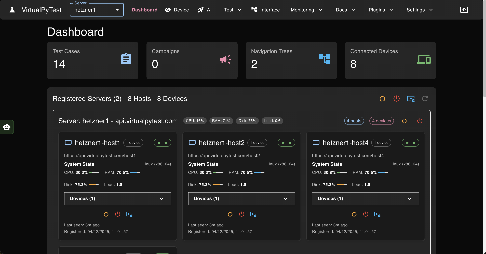
  </a>
</div>

---

## What it is

VirtualPyTest captures what a device shows (HDMI, camera, screen mirroring, browser) and drives it back (IR, Bluetooth remote, ADB, Appium, Playwright). On top of that it gives you a navigation graph of your app, a test runner, 24/7 monitoring, and Grafana analytics.

It runs on Linux, Raspberry Pi, Docker, or the cloud, and targets set-top boxes, Android TV, mobile phones, web apps, and anything else you can point a capture card at. It is built to replace commercial device-testing suites that cost $50k+ per year.

---

## See it in action

<div align="center">
  <a href="https://www.youtube.com/watch?v=RBgS376Blvo">
    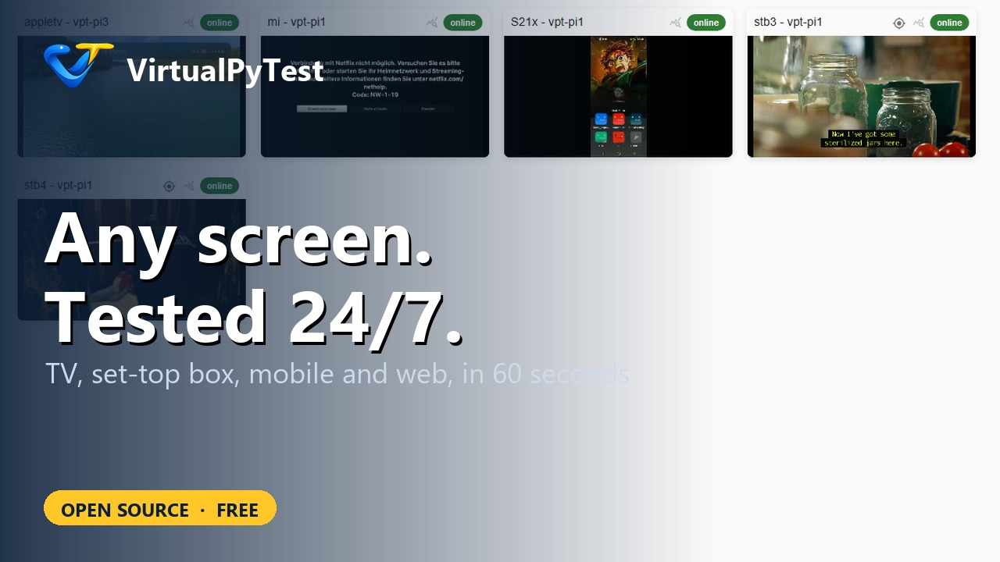
  </a>
  <p><a href="https://www.youtube.com/watch?v=RBgS376Blvo"><b>VirtualPyTest in 60 seconds</b></a> — dashboard, devices, heatmap, a test run, its report and the KPI it measured.</p>
</div>

<table align="center">
  <tr>
    <td align="center" width="33%">
      <a href="https://www.youtube.com/watch?v=_CP29LQe0xQ">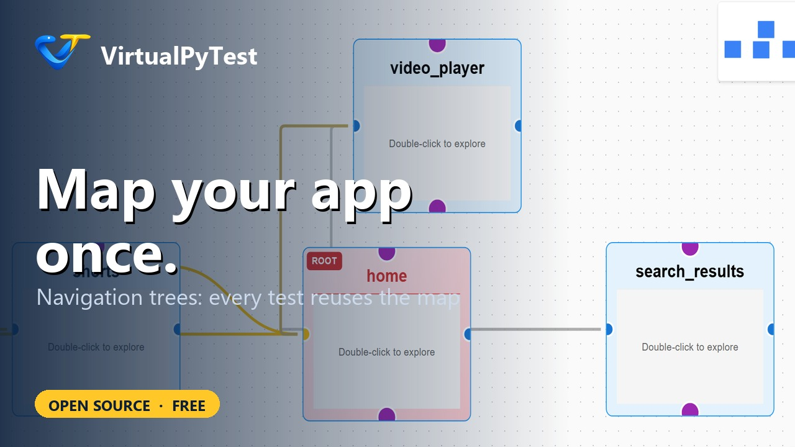</a><br>
      <a href="https://www.youtube.com/watch?v=_CP29LQe0xQ"><b>Map your app once</b></a><br>
      <sub>Screens as nodes, actions as edges, one goto that drives a real browser</sub>
    </td>
    <td align="center" width="33%">
      <a href="https://www.youtube.com/watch?v=bBheQqaRIQM">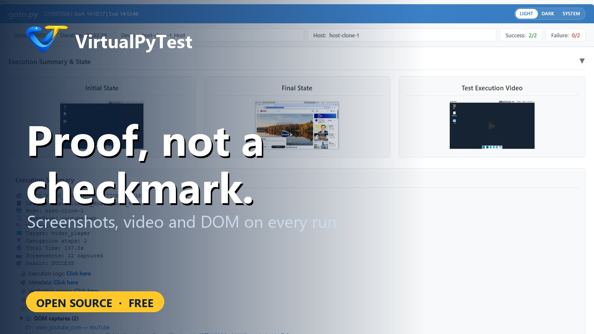</a><br>
      <a href="https://www.youtube.com/watch?v=bBheQqaRIQM"><b>Proof, not a checkmark</b></a><br>
      <sub>Every step with its screenshot, verification and evidence</sub>
    </td>
    <td align="center" width="33%">
      <a href="https://www.youtube.com/watch?v=prG2eqnbjfs">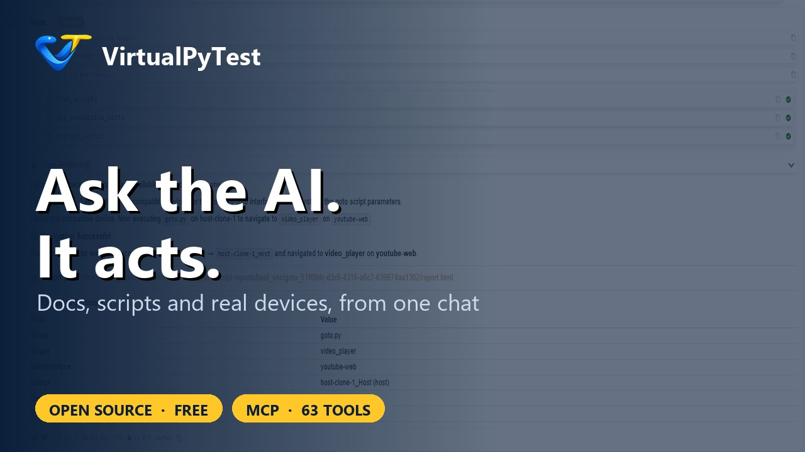</a><br>
      <a href="https://www.youtube.com/watch?v=prG2eqnbjfs"><b>Ask the AI, it acts</b></a><br>
      <sub>Answers from the docs, then runs a script on a device from the chat</sub>
    </td>
  </tr>
  <tr>
    <td align="center" width="33%">
      <a href="https://www.youtube.com/watch?v=rFkZxSoK0zM">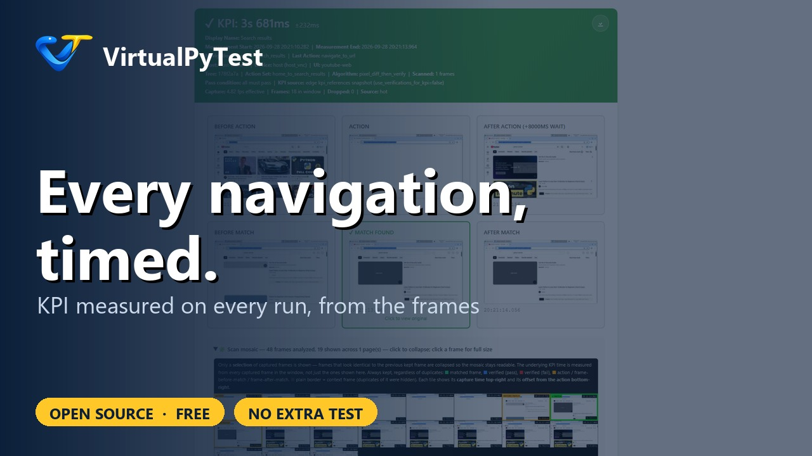</a><br>
      <a href="https://www.youtube.com/watch?v=rFkZxSoK0zM"><b>Every navigation, timed</b></a><br>
      <sub>A KPI on every run, measured from the frames, with its report</sub>
    </td>
    <td align="center" width="33%">
      <a href="https://www.youtube.com/watch?v=TcRkqETFlco">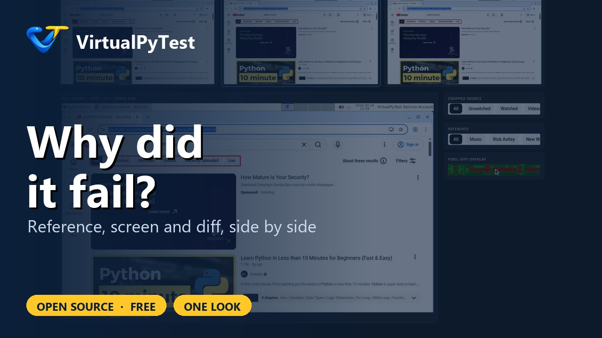</a><br>
      <a href="https://www.youtube.com/watch?v=TcRkqETFlco"><b>Why did it fail?</b></a><br>
      <sub>Reference, screen and pixel diff, side by side, from a failed step</sub>
    </td>
    <td align="center" width="33%">
      <a href="https://www.youtube.com/watch?v=9cjzYpDVROs">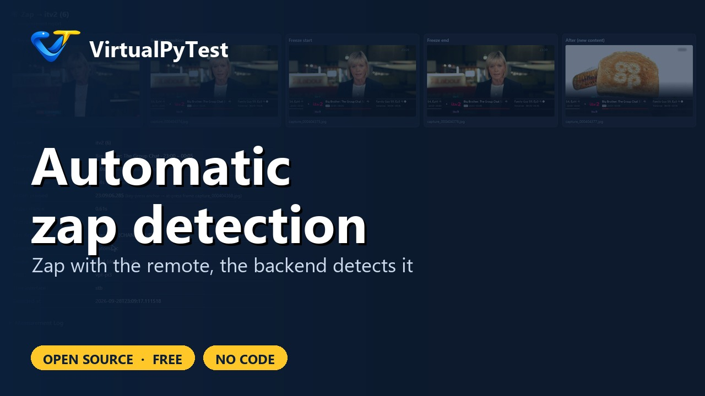</a><br>
      <a href="https://www.youtube.com/watch?v=9cjzYpDVROs"><b>Automatic zap detection</b></a><br>
      <sub>Zap with the remote: the backend detects and times it, no code to write</sub>
    </td>
  </tr>
  <tr>
    <td align="center" width="33%">
      <a href="https://www.youtube.com/watch?v=DR8IX3Y_rCs">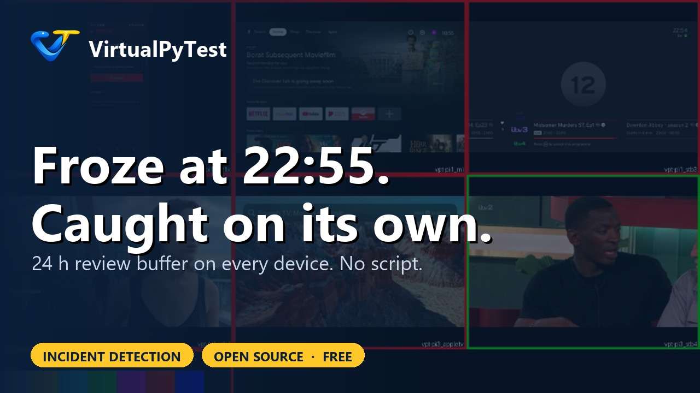</a><br>
      <a href="https://www.youtube.com/watch?v=DR8IX3Y_rCs"><b>Automatic incident detection</b></a><br>
      <sub>Freezes caught on their own, and a 24 h review buffer on every device, no script</sub>
    </td>
    <td align="center" width="33%">
      <a href="https://www.youtube.com/watch?v=xWZyBp7Npck">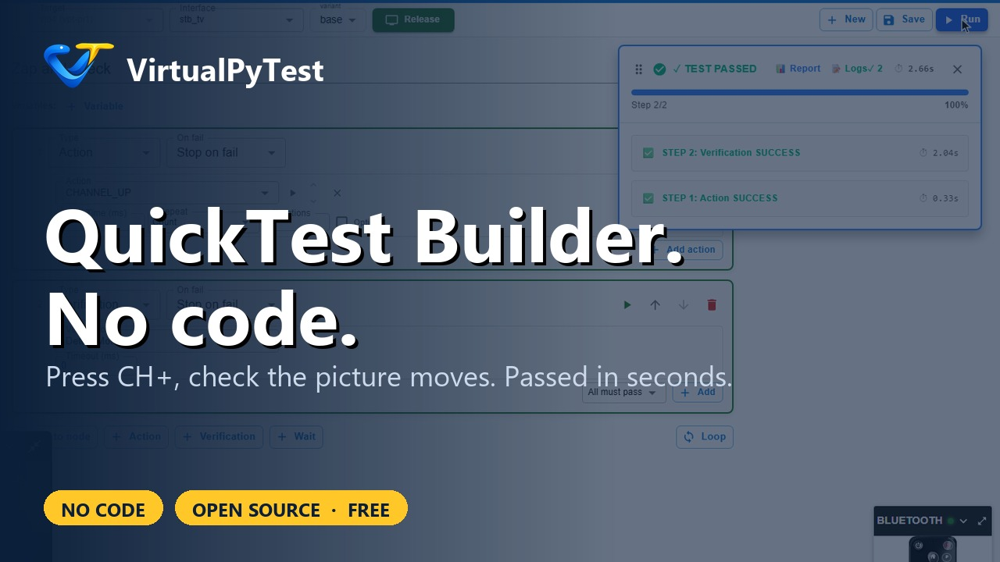</a><br>
      <a href="https://www.youtube.com/watch?v=xWZyBp7Npck"><b>QuickTest Builder</b></a><br>
      <sub>No code, just steps: press CH+, check the picture moves, run</sub>
    </td>
  </tr>
</table>

All videos, with new ones as they come, are on the [Videos page](https://virtualpytest.angelstreet.io/docs/videos).

---

## Features

<!-- Mirror of docs/features/README.md (the in-app Features page). Keep order and titles in sync. -->

<table>
  <tr>
    <td width="50%" valign="top">
      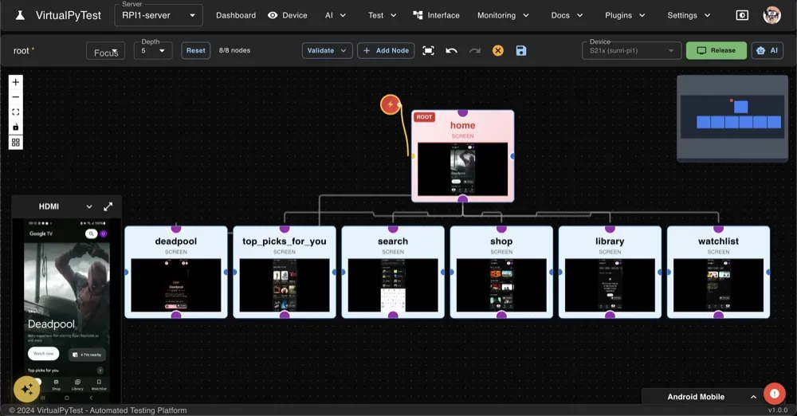<br>
      <b>Map your app once, every test reuses it.</b><br>
      Every screen and path becomes a reusable graph. Change a screen once and every test follows.
    </td>
    <td width="50%" valign="top">
      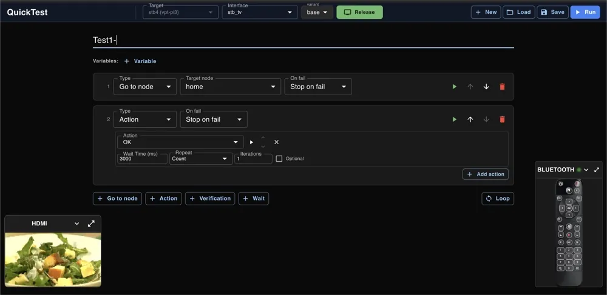<br>
      <b>No-code for the team, Python for the engineers.</b><br>
      Visual drag-and-drop builder for everyone. Full Python the moment you need real logic.
    </td>
  </tr>
  <tr>
    <td width="50%" valign="top">
      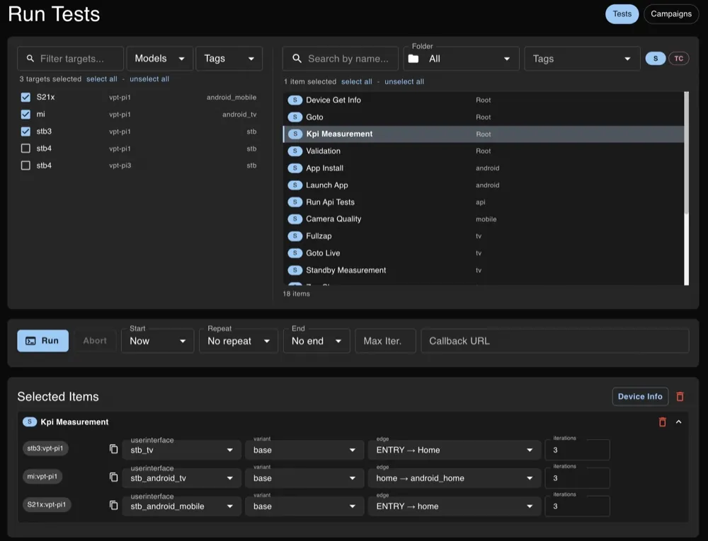<br>
      <b>One script, every platform.</b><br>
      The navigation graph keeps the UI out of the script. Named variants override only what differs per model.
    </td>
    <td width="50%" valign="top">
      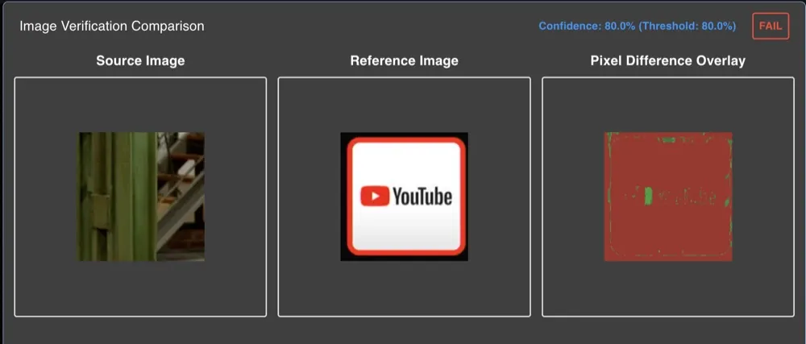<br>
      <b>It proves what is actually on screen.</b><br>
      Image matching, OCR text, and AI detectors. Every check shows source, reference, and pixel diff.
    </td>
  </tr>
  <tr>
    <td width="50%" valign="top">
      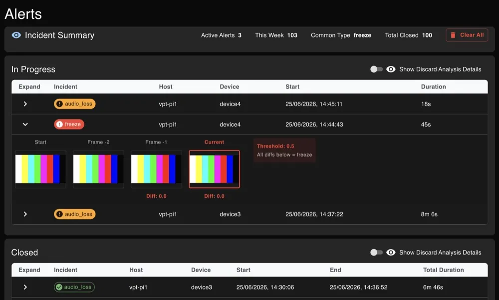<br>
      <b>Black screen, freeze, audio loss, caught in real time.</b><br>
      Every device watched around the clock. Incidents alerted the moment they happen and tracked to resolution.
    </td>
    <td width="50%" valign="top">
      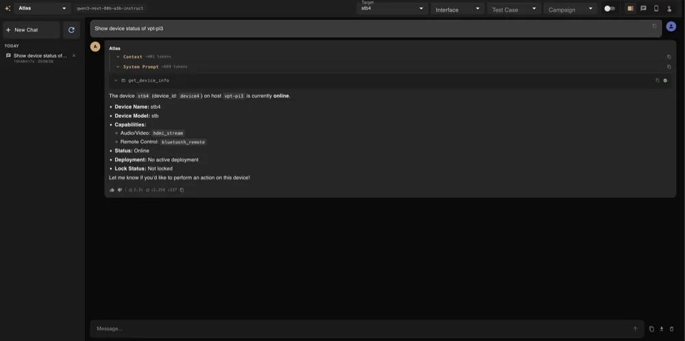<br>
      <b>Talk to your lab. The AI drives the device.</b><br>
      A real agent on a real model, with a built-in MCP server so any AI client can inspect and control devices.
    </td>
  </tr>
</table>

<details>
<summary><b>Show 10 more features</b> (references, A/V quality, reports, Grafana, heatmap and rewind, fleet, device info, permissions, web UI, health)</summary>
<br>

<table>
  <tr>
    <td width="50%" valign="top">
      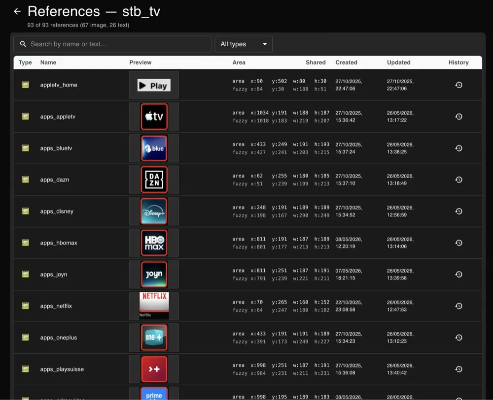<br>
      <b>Reference images and text, easy to maintain.</b><br>
      One library for every reference. Auto OCR and focus detection, one-click recapture when the UI changes.
    </td>
    <td width="50%" valign="top">
      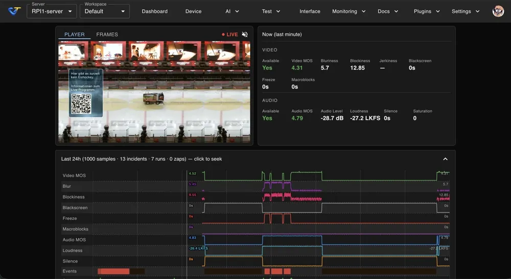<br>
      <b>Audio and video quality, measured every minute.</b><br>
      Per-minute A/V quality KPIs per device, with trends per platform and software version.
    </td>
  </tr>
  <tr>
    <td width="50%" valign="top">
      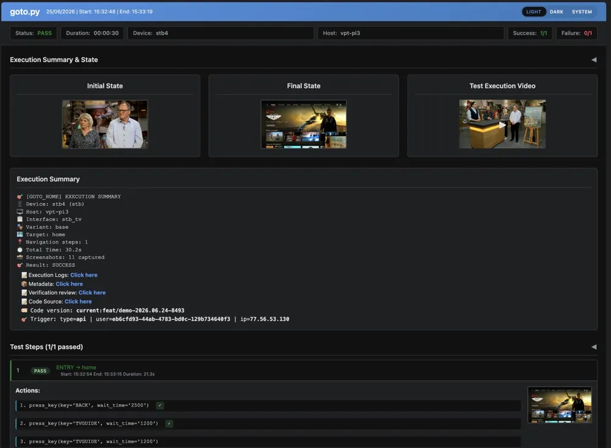<br>
      <b>Every run, a report you can read.</b><br>
      Pass/fail summary with initial and final state, video, and KPI and zapping times captured automatically.
    </td>
    <td width="50%" valign="top">
      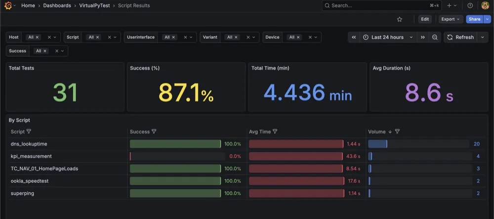<br>
      <b>Every result, in native Grafana dashboards.</b><br>
      Pass rates, duration, and volume per script. Per-step KPI radars across versions. Standard Grafana, yours to extend.
    </td>
  </tr>
  <tr>
    <td width="50%" valign="top">
      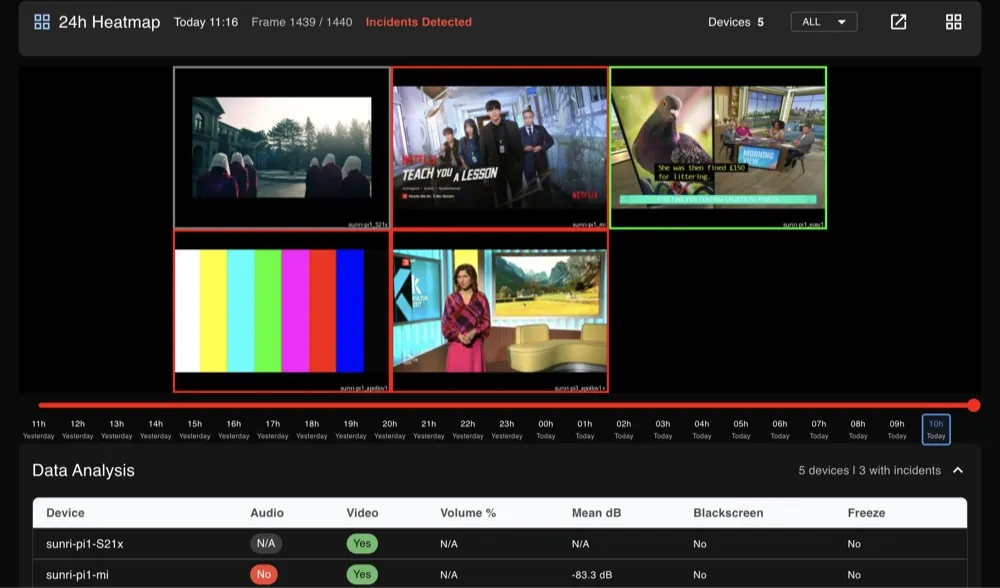<br>
      <b>A fleet heatmap and 24h of screen to scrub back.</b><br>
      One glance shows where the fleet hurts. Every device's screen is recorded, so you can see what happened at 3 a.m.
    </td>
    <td width="50%" valign="top">
      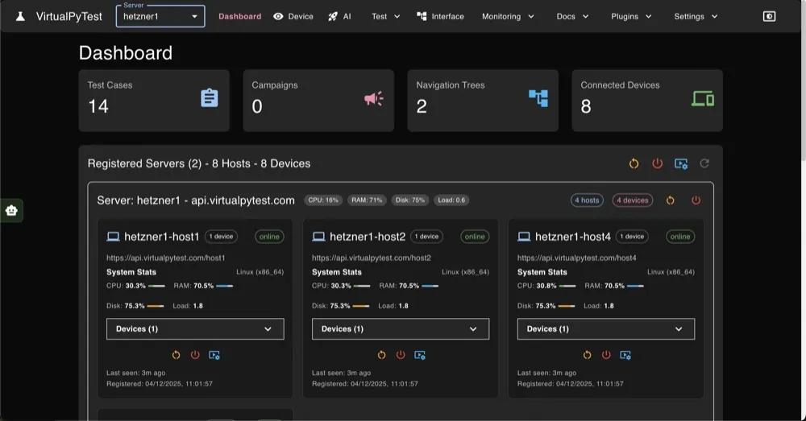<br>
      <b>Your whole fleet, status and live screen.</b><br>
      Hosts, devices, and system metrics on one dashboard. Live screen of every device, restart services from the browser.
    </td>
  </tr>
  <tr>
    <td width="50%" valign="top">
      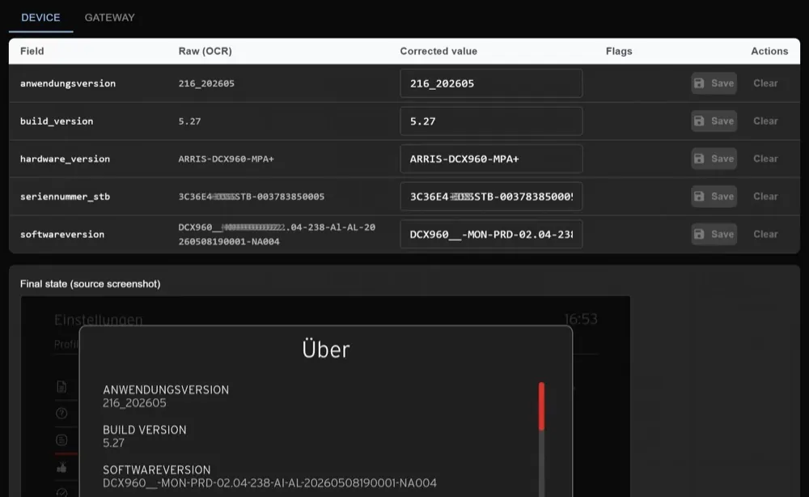<br>
      <b>Device details, read straight off the screen.</b><br>
      Model, firmware, and version auto-extracted from the device's own About screen, in any language.
    </td>
    <td width="50%" valign="top">
      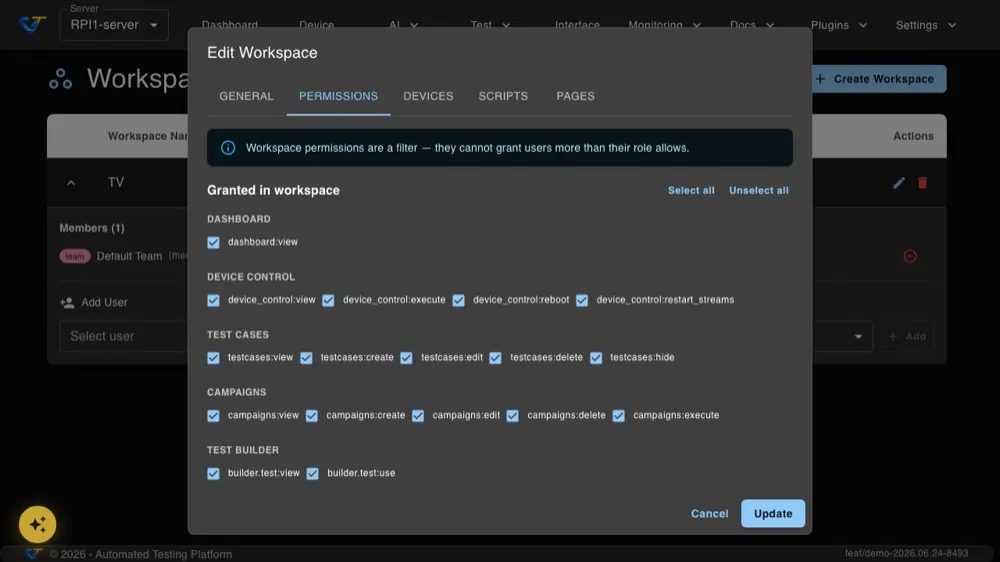<br>
      <b>Permissions, down to the last action.</b><br>
      Scoped per workspace, team, and user. Grant or deny every single action.
    </td>
  </tr>
  <tr>
    <td width="50%" valign="top">
      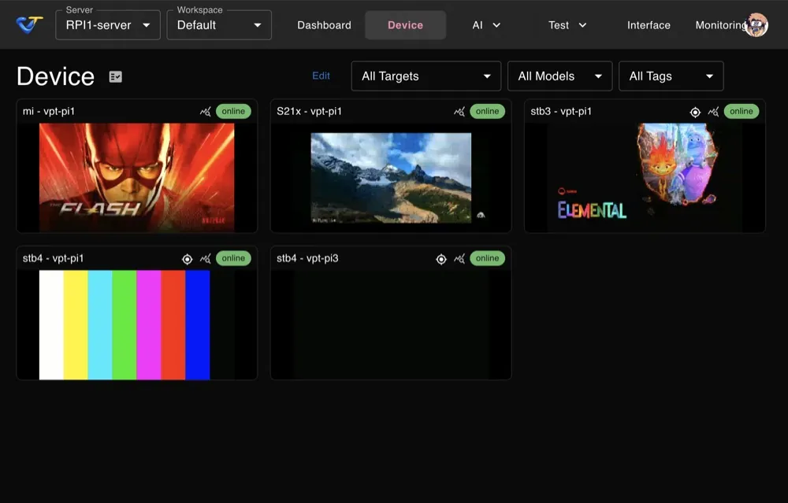<br>
      <b>Runs in any browser, desktop to phone.</b><br>
      Nothing to install. Fully responsive, so you can operate the whole lab from anywhere.
    </td>
    <td width="50%" valign="top">
      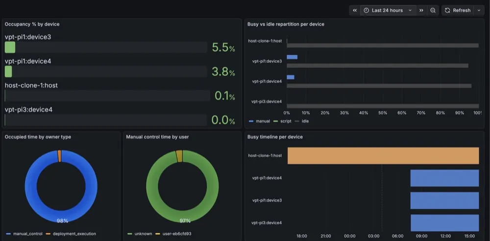<br>
      <b>Every device accounted for, every host healthy.</b><br>
      Device occupancy (busy vs idle, manual vs script) and host CPU, memory, disk, and temperature, 24/7.
    </td>
  </tr>
</table>

</details>

<p align="center">Full feature tour with larger screenshots: <a href="https://virtualpytest.angelstreet.io/docs/features"><b>virtualpytest.angelstreet.io/docs/features</b></a></p>

---

## Quick start

```bash
git clone https://github.com/AngelStreetCorp/virtualpytest.git
cd virtualpytest
./setup/docker/install_docker.sh   # only if Docker is not installed yet
./setup/docker/launch.sh           # full stack: database, server, host, web UI, Grafana
```

`launch.sh` generates every secret, builds the images and prints the URLs when the API answers —
the web UI is on `http://<this-machine>:5073`. Every install path (Docker, one VM, Proxmox
fleet, developer setup) starts from the [Get Started guide](docs/get-started/README.md).

For Docker there are two supported shapes: use the command above for the complete Compose stack,
or run `./setup/docker/launch.sh --host-only` when this machine only owns devices and should join
a server elsewhere. The registry publishes separate `virtualpytest-server`, `virtualpytest-host`,
and `virtualpytest-frontend` images; Compose pulls them together rather than providing one
monolithic image. See [Install with Docker](docs/get-started/docker.md) and
[Add a host](docs/get-started/add-a-host.md).

---

## Why VirtualPyTest

| | VirtualPyTest | Commercial tools |
| :--- | :---: | :---: |
| **Cost** | Free, open source | $50k+ / year |
| **Runs on** | Linux, Raspberry Pi, Docker, cloud | Often Windows only |
| **Source code** | Yours to read and modify | Vendor locked |
| **Monitoring, analytics, AI** | Included | Paid add-ons |

### What we do that they don't

Stb-tester gives you Python. Witbe gives you no-code. VirtualPyTest gives you both, and AI can drive all of it.

| | VirtualPyTest | Stb-tester | Witbe |
| :--- | :---: | :---: | :---: |
| **Free** | ✅ | ❌ | ❌ |
| **Open source** | ✅ | ✅ | ❌ |
| **Python scripting** | ✅ | ✅ | ❌ |
| **No-code builder** | ✅ | ❌ | ✅ |
| **AI drives the whole platform through MCP** | ✅ | ❌ | ❌ |
| **Hosts on any hardware, Raspberry Pi included** | ✅ | ❌ | ❌ |
| **Integration: Grafana, TestRail, Postman, Langfuse,slack** | ✅ | ❌ | ❌ |
| **Farms SauceLabs/BrowserStack and emulators** | ✅ | ❌ | ❌ |
| **Fine-grained permissions and Workspace ** | ✅ | ❌ | ❌ |
| **Heatmap across devices** | ✅ | ❌ | ❌ |
| **Automatic KPI measurement** | ✅ | ❌ | ❌ |
| **Automatic incident detection** | ✅ | ❌ | ❌ |
| **Requirements and test coverage** | ✅ | ❌ | ❌ |
| **Ask AI assistant** | ✅ | ❌ | ❌ |
| **24h review buffer on every device** | ✅ | ❌ | ❌ |
| **Add your own controllers for new devices and test systems** | ✅ | ⚠️ | ❌ |

⚠️ partial · ❌ not offered (checked September 2026)

---

## FAQ

The five questions worth asking any testing vendor, answered for VirtualPyTest. More in the [full FAQ](docs/faq/README.md).

<details>
<summary><b>Can you test our production app on multiple platforms without changing our code?</b></summary>

**Yes.** Nothing is installed in your app: no SDK, no instrumentation, no test build. The screen is captured from the outside (HDMI, camera, screen mirroring, browser) and the device is driven the way a user drives it (IR or Bluetooth remote, ADB, Appium, Playwright). The same script runs on STB, Android TV, mobile and web; the navigation tree holds what differs per platform. See [Unified controller](docs/features/unified-controller.md).

</details>

<details>
<summary><b>Can you show a live event monitored on multiple platforms, with a recording of what viewers saw?</b></summary>

**Yes.** Every device's screen is visible at once, with a fleet heatmap flagging devices in trouble. Each device's HDMI output is recorded continuously (video, audio, transcript) on a **rolling 24-hour buffer**, and incidents keep their start and end frames as evidence. See [Visual capture](docs/features/visual-capture.md).

</details>

<details>
<summary><b>Do you measure picture and sound quality, or only whether a screen appeared?</b></summary>

**Both**, on every captured frame, 24/7: black screen, freeze, blur, blockiness; audio loss, silence, loudness (LKFS), saturation; subtitles (OCR + language detection), zapping, banners; plus an approximate MOS (1–5) per minute in Grafana. The MOS is an indicator, not a certified lab measurement (no VMAF). See [AV quality](docs/features/avq.md).

</details>

<details>
<summary><b>What happens to our tests when we redesign the app or switch language?</b></summary>

**The scripts don't change.** Scripts name destinations like `navigate_to("settings")`, never pixels or selectors, so a redesign only touches the navigation tree: recapture reference images in one click or let AI exploration rebuild nodes. Screens are recognised by a layout fingerprint that tolerates translated text, and text checks use OCR with language detection and fuzzy matching. A full redesign still needs someone to review the updated tree.

</details>

<details>
<summary><b>What will 24/7 monitoring on all our devices cost per month, with no surprises?</b></summary>

**Software: €0 a month.** Open source (AGPL v3), self-hosted, no licence, per-device or usage fees. Hardware is a one-time cost: ~€420 for 1 device (Raspberry Pi 5 + HDMI capture card), ~€480 for up to 4 devices on one host, ~€7 per extra capture card. Running costs are electricity, plus storage beyond the default 24 h of recordings (~7.5 GB per device per day). See the [hardware guide](docs/get-started/hardware.md).

</details>

---

## Community & Support

- **🐛 Issues**: report bugs or request features on [GitHub Issues](https://github.com/AngelStreetCorp/virtualpytest/issues).
- **💬 Discussions**: ask questions and share ideas in [GitHub Discussions](https://github.com/AngelStreetCorp/virtualpytest/discussions).
- **🤝 Contributing**: see [CONTRIBUTING.md](CONTRIBUTING.md).
- **💖 Sponsor**: support the project on [GitHub Sponsors](https://github.com/sponsors/angelstreet).

---

## License

VirtualPyTest is open source under the [GNU AGPL v3](LICENSE). Free to use, study, modify, and self-host, including for commercial internal use. If you distribute a modified version or offer it to others as a service, you must publish your modifications under the same license. For commercial licensing outside these terms, contact the author.
