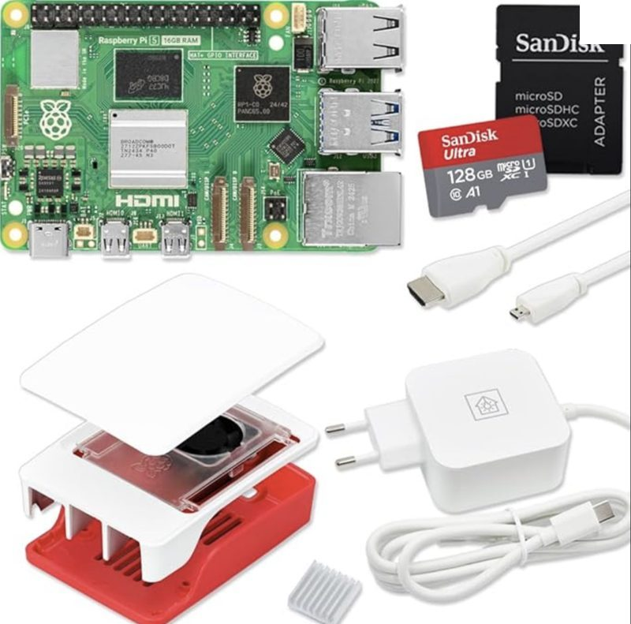
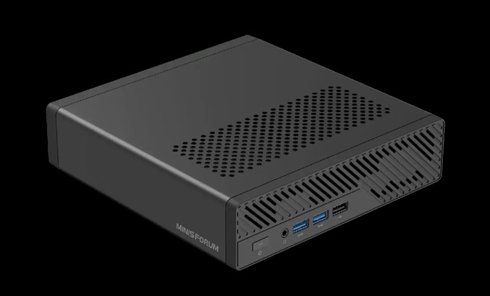
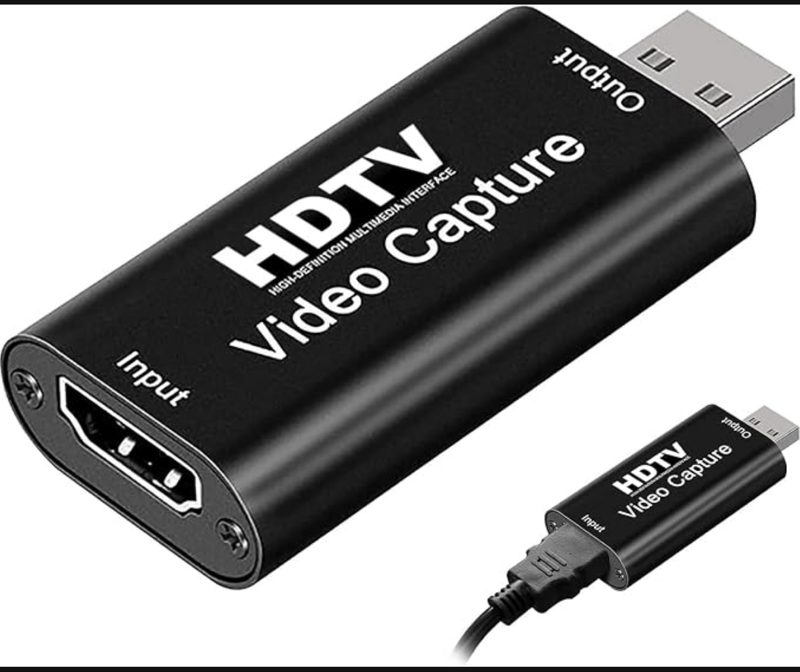

# Hardware

What to buy to run VirtualPyTest, with the sizes we run ourselves. Prices are the usual
street prices in Europe; listings churn, so pick the item that matches the description.

You need two things: a **host** (the computer VirtualPyTest runs on) and one **HDMI capture card per device** you want to test. Everything below is hardware we run ourselves.

---

## Which host?

| | Standalone: Raspberry Pi 5 | Lab: Mini PC with Proxmox |
|---|---|---|
| **Best for** | First try, demo, up to 4 devices | Several racks of devices, Android emulators (64 GB), GPU for a local LLM |
| **Runs** | Everything in Docker on one board | Proxmox with one VM per role |
| **Price** | ~€405 (complete kit) | from €839 |
| **Time to first test** | ~30 min | ~2 h |

Not sure? Start with the Raspberry Pi. One Pi 5 16 GB runs 4 devices in our lab without issue, and it stays useful as a capture host next to the devices when you later add a mini PC.

---

## 1. Standalone: Raspberry Pi 5 (16 GB)



**Buy:** [Raspberry Pi 5 16 GB starter kit on Amazon](https://www.amazon.fr/dp/B0858JBNZF) — ~€405

The kit has everything: Pi 5 with 16 GB RAM, 45 W power supply, official case with fan, 128 GB microSD, heatsink, micro-HDMI cable.

- **16 GB** is the version to get. It runs the whole platform plus 4 captured devices. The 8 GB board is fine for one device, but the database, the backend and four FFmpeg captures together need the headroom.
- Plug capture cards straight into the Pi's **blue USB 3.0 ports**. Never use a USB extension cord on a capture card.
- Two or more capture cards on one Pi: add a **powered USB 3.0 hub**. The Pi's ports cannot power more than one grabber reliably under capture load.
- Wired Ethernet. Wi-Fi drops on the Pi are the number one cause of "device offline".

**Then:** flash Raspberry Pi OS 64-bit, `git clone` the repo and run the Docker quickstart, see [Docker](docker.md).

---

## 2. Lab: Minisforum MS-A2 with Proxmox



**Buy:** [Minisforum MS-A2 Workstation, 32 GB RAM + 1 TB SSD](https://minisforumpc.eu/products/ms-a2-mini-pc?variant=52008103772526) — €839 (list €1,049)

| Spec | MS-A2 |
|---|---|
| CPU | AMD Ryzen 9 9955HX, 16 cores / 32 threads |
| RAM | 32 GB DDR5 (64 GB and 96 GB variants exist, 2 SO-DIMM slots) |
| Storage | 1 TB NVMe, three NVMe slots total (2× M.2 + 1× U.2) |
| Network | 2× 2.5 GbE RJ45, 2× 10 GbE SFP+, Wi-Fi 6E |
| GPU | Radeon 610M integrated. PCIe x16 slot (x8 bandwidth) takes a **discrete GPU** for local AI |

Install **Proxmox VE** on it and create these VMs:

| VM | vCPU | RAM | Disk | Role |
|---|---|---|---|---|
| `vpt-core` | 4 | 8 GB | 60 GB | Server + frontend + database + Grafana (Docker) |
| `vpt-host-N` | 2 | 4 GB | 40 GB | One per group of devices. FFmpeg capture + device control |
| `vpt-emulator` (optional) | 8 | 12 GB | 40 GB | **One** Android emulator (mobile, tablet or TV). CPU type must be `host`. Full sizing: [Emulators](emulators.md) |

Physical devices connect either to a **Raspberry Pi host** placed next to them (recommended, the Pi from section 1 does this job), or to a `vpt-host` VM with the USB capture cards passed through in Proxmox (VM → Hardware → Add → USB Device).

### Never overcommit RAM

**Keep the sum of all VM memory at or below physical RAM minus 8 GB for Proxmox itself.** CPU can be oversubscribed; RAM cannot. Once the hypervisor starts swapping, guest pages go to disk while the guest is still trying to use them, and the guest does not slow down — it **freezes**, with the VM still showing `running`. We learned this the hard way: a node at 120 % RAM allocation lost two VMs to frozen guests, one of them stuck for 29 hours before anyone noticed. Emulator VMs go first, because they are the largest and the least tolerant of losing pages.

That makes the RAM variant the real decision, not an upgrade:

| | 32 GB | 64 GB |
|---|---|---|
| Proxmox host | 4 GB | 4 GB |
| `vpt-core` | 8 GB | 8 GB |
| `vpt-host` | 4 GB | 4 GB |
| Emulator VMs | 1 × 12 GB | 3 × 12 GB |
| **Allocated** | **28 of 32 GB** | **52 of 64 GB** |
| Headroom | 4 GB — no second emulator, ever | comfortable |

**Take 64 GB** if you intend to test on emulators at all: 32 GB fits the platform plus exactly one, with nothing left. 32 GB is fine for a lab driving physical devices through capture cards, where the Pis do the work. The local LLM in section 4 needs 64 GB on its own, on top of this.

The GPU is the real difference from a Pi: a Pi has none, the MS-A2 has an integrated one and a slot for a proper card. That is what makes local AI possible on it.

---

## 3. HDMI capture card (one per device)



**Buy:** [HDMI → USB capture card on Amazon](https://www.amazon.fr/dp/B0H6WQ2VXC) — €7

This is the MacroSilicon **MS2109** (`534d:2109`, sold as "USB 3.0 HDMI video capture card").
It is what our lab runs on every set-top box and TV, four per host.

- HDMI in, USB out, 1080p at 30 fps, audio included. Linux sees it as a V4L2 camera plus an ALSA sound card, nothing to install.
- Accepts 4K input, captures at 1080p. That is enough for image and OCR verification.
- Buy one per device. Buy a spare, at this price a dead unit is not worth debugging.
- From the **third dongle on a host**, add a powered USB 3 hub: MS2109s share one
  controller's bandwidth and power, and an unpowered hub makes them drop off the bus.
- One dongle per ffmpeg process. Each also exposes a USB audio input (`plughw:N,0`)
  you can capture alongside the video.
- Pricier cards (Elgato Cam Link, Magewell) work but bring nothing the platform uses.
- Phones and tablets: add a **USB-C to HDMI adapter** between the phone and the capture card, or skip HDMI entirely and capture the screen over ADB.

If the card streams for a few seconds then disappears, it is almost always the USB link: extension cord, unpowered hub, or a Pi port under load. See [HDMI Capture Not Working](../user-guide/troubleshooting.md#hdmi-capture-not-working).

---

## 4. Optional: local LLM on the same Proxmox

If you do not want test generation and agent traffic to leave your network, the MS-A2 can also host a local model. This needs the **64 GB** variant and a second NVMe. Two ways to run it:

- **GPU (recommended):** put a discrete GPU with 16 GB VRAM in the PCIe x16 slot, pass it through to VM 100 in Proxmox, and serve a model with Ollama or vLLM. Tens of tokens per second, usable interactively. Check the card's length and power against the MS-A2 case before buying. The integrated Radeon 610M is too small for this, it only covers display and hardware video decode.
- **CPU only:** Colibri, below. No extra hardware, but slow.

```
VM 100 — AI                          VM 101 — AI Agent
────────────────────────             ────────────────────────
16 vCPU                              8 vCPU
32 GB RAM                            16 GB RAM
1 TB NVMe passthrough                256 GB disk

Colibri + GLM-5.2                    Ubuntu 24.04
10.10.10.10:8000                     OpenCode, Aider, Git, Docker,
        ▲                            Node, Python, Go/Rust
        │ HTTP / OpenAI API          Repositories: /workspace
        └─────────────────────────── 10.10.10.20
```

- **VM 100** runs [Colibri](https://www.alphamatch.ai/blog/colibri-ai-engine-glm-5-2-25gb-ram-2026) (CPU path), a CPU-only inference engine that serves GLM-5.2 (744 B parameters, mixture of experts) from about 25 GB of RAM by streaming experts from NVMe. The NVMe passthrough is not optional: the engine's speed is the disk's speed. Expect on the order of 1 token per second at best, so it suits batch jobs, not interactive chat.
- **VM 101** is a coding-agent box. OpenCode and Aider talk to VM 100 over its OpenAI-compatible API.
- **VirtualPyTest uses it too.** In Settings → AI, fill *Local model server* with the base URL (`http://10.10.10.10:8000/v1`) and the model name, then pick **Local** as the provider for the agent, vision or text tasks. Same thing in the server `.env`: `AI_PROVIDER=local`, `LOCAL_AI_BASE_URL`, `LOCAL_AI_MODEL`. Any OpenAI-compatible server works: Ollama, vLLM, llama.cpp, LM Studio, Colibri.

---

---

## Proxmox node sizing (full fleet)

Section 2 sizes a single MS-A2. If you run the [full fleet layout](proxmox.md#proxmox-fleet)
— database, server, frontend, storage, monitoring, proxy plus N host VMs — size the node itself:

| | Minimum | Comfortable (what this project runs) |
|---|---|---|
| **Proxmox node** | 8 cores / 16 threads · 64 GB RAM · 2 × 1 TB NVMe (mirror) · 1 GbE | AMD Ryzen 9 3900 (12 c / 24 t) · 128 GB RAM · 2 × 1.9 TB NVMe in RAID 1 — carries 19 VMs with ~150 GB allocated |
| **One VM running everything** ([one VM](proxmox.md#one-vm) or [Docker](docker.md)) | 4 cores · 8 GB · 60 GB disk | 6 cores · 16 GB · 120 GB NVMe, plus 2 cores and 4 GB per capture card attached to it |
| **Host VM** (device controller, one per group of devices) | 4 vCPU · 8 GB · 32 GB disk | same; USB devices passed through from the node |

A Proxmox node is any x86 machine that boots Debian: a Hetzner/OVH dedicated server, a tower
with two NVMe drives, or a NUC-class box for a small fleet. It needs one NIC on the LAN the
devices live on. Capture cards and IR transmitters plug into the node and are passed through
to the host VM (*Hardware → Add → USB device*).

### A host can also be its own x86 box

When the devices are far from the server, or you want a small box next to the TV rack, the
host role runs on its own machine instead of a Pi:

| Machine | Fits | Notes |
|---|---|---|
| **Raspberry Pi 5** (section 1) | 1–4 devices, IR/Bluetooth remotes, web tests | No hardware H.264 encoder: 1080p capture is CPU-bound, keep FPS low. Built-in Bluetooth adapter is good for remote emulation |
| **Minisforum N100 mini PC** (16 GB, 512 GB NVMe) | 2–4 devices with HDMI capture | Hardware video encode, 4+ USB 3 ports, x86 so identical to the VM path |

Any Linux x86 box with USB 3 ports works the same way
(`setup/local/linux/backend_host/install_host.sh`).

---

## Control hardware (only for devices without network or ADB control)

| Item | Use | Price |
|---|---|---|
| **USB IR transmitter** (`lirc`-compatible: USB IR Toy, or any `ir-ctl` device) | set-top boxes and TVs with an IR remote; declared as `DEVICEn_IR_PATH=/dev/lircN` | ~15–30 € |
| **IRTrans LAN box** | one networked IR box driving up to 16 STBs by LED output; declared with `DEVICEn_IR_IP` / `_IR_LED` | ~250 € |
| **Bluetooth adapter** | Bluetooth remote emulation (Pi 5 built-in works; on x86 a plain USB BLE dongle) | ~10 € |
| **Smart plug** (Tapo P100/P110) | power-cycle a device from a test (`DEVICEn_POWER_*`) | ~10 € |
| **USB-C hub with HDMI** | phones/tablets: HDMI out to a capture dongle, ADB over the same cable | ~20 € |
| **HDMI splitter** (optional) | keep a monitor on the device while capturing | ~15 € |

Android devices reachable over the network need nothing but ADB enabled; web targets need nothing.

## Shopping list

| Setup | Items | Total |
|---|---|---|
| **Standalone, 1 device** | Pi 5 16 GB kit + 1 capture card + 1 HDMI cable | ~€420 |
| **Standalone, up to 4 devices** | above + powered USB 3.0 hub + 1 capture card per device | ~€480 |
| **Lab, physical devices** | MS-A2 32 GB + 1 Pi kit per device rack + 1 capture card per device | from €1,260 |
| **Lab + emulators** | MS-A2 **64 GB** (€1,379) + Pi kits + capture cards — 32 GB fits only one emulator VM | from €1,800 |
| **Lab + local LLM** | MS-A2 64 GB (€1,379) + second 1 TB NVMe + discrete GPU 16 GB VRAM + Pi kits + capture cards | from €2,400 |

Optional, only for devices that have no network or ADB control:

| Item | Use |
|---|---|
| USB infrared transmitter (FLIRC or USB IR Toy) | Sends remote-control keys to a set-top box |
| Smart plug | Power-cycles a device from a test |

---

## Start in 3 steps

1. Buy a host and one capture card per device.
2. Device HDMI out → capture card → host USB port. Host on wired Ethernet.
3. Install the software: [Docker](docker.md) or [Proxmox](proxmox.md).

---
